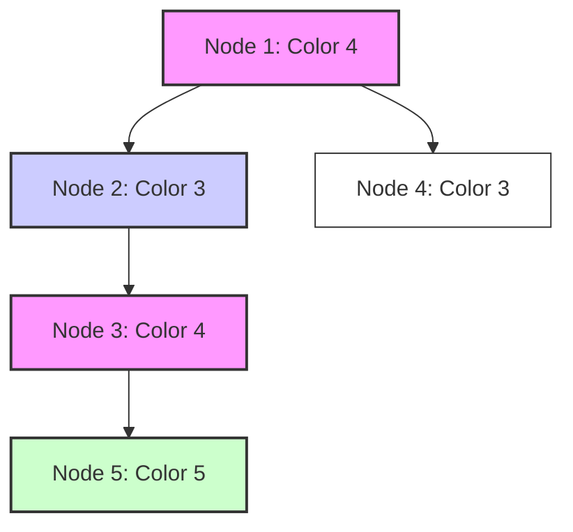

# Beautiful Subtree Set Explainer

## Problem Description & Example Test Case
You are given a tree with $n$ nodes rooted at node 1. You are also given an array `color` representing the color of each node in the tree.
A set of nodes is **beautiful** if it satisfies the following conditions:
- All nodes in the set have different colors.
- For any pair of nodes $(u, v)$ in the set, either $u$ is the ancestor of $v$ or $v$ is the ancestor of $u$ within the tree.

You're given $q$ queries where each query provides an integer $s$ representing a node in the tree.
The answer to each query is the maximum size of a beautiful set that can be formed by selecting nodes from the subtree rooted at node $s$.

Find the sum of answers to all queries. Since the answer can be large, return it modulo $10^9+7$.

### Example Test Case
**Input:**
```text
5
0
1
2
1
3
4
3
4
3
5
3
4
3
3
```
**Output:**
```text
5
```
**Explanation:**
- $n = 5$
- Parent array: `p = [0, 1, 2, 1, 3]` (1 is root, 2's parent is 1, 3's parent is 2, 4's parent is 1, 5's parent is 3).
- Colors: `color = [4, 3, 4, 3, 5]`
- Queries: `[4, 3, 3]`

- For query $s = 4$: Subtree of 4 contains only node 4. Max size is 1.
- For query $s = 3$: Subtree of 3 contains $\{3, 5\}$. We can select $\{3, 5\}$ which have colors $4$ and $5$ (distinct). Max size is 2.
- For query $s = 3$: Max size is 2.
- Total sum: $1 + 2 + 2 = 5$.

---

## Prerequisite Concepts
- **Tree Traversal (DFS):** Traversing a tree to explore all descendant paths.
- **Set Operations:** Tracking distinct colors along a path.

---

## The Naive Approach
A naive approach would perform a backtracking search to find all possible valid subsets in the subtree of $s$, check the ancestor-descendant and color constraints for each subset, and find the maximum size. This takes exponential time.
- **Time Complexity:** $O(2^N)$
- **Space Complexity:** $O(N)$

---

## Guided Discovery (The Optimal Approach)
Let's analyze the properties of a beautiful set:
1. Every pair of nodes in the set must have an ancestor-descendant relationship. This means the entire set of nodes must lie on a single downward path from some node $u$ to some leaf $L$.
2. All nodes in the set must have different colors.

If we choose a path from some node $u$ to a leaf $L$, the maximum number of nodes we can select with distinct colors is exactly the number of distinct colors present on the path from $u$ to $L$.
Thus, the maximum size of a beautiful set in the subtree of $s$ is simply the maximum number of distinct colors on any downward path starting at some node $u$ in the subtree of $s$.

Since $N \le 10^3$, we can easily compute this:
1. For each node $u$, find the maximum number of distinct colors on a downward path starting at $u$. We can do this by running a simple DFS starting at $u$, keeping track of the set of colors on the current path. Let this value be $dp[u]$.
2. The answer for a query $s$ is the maximum of $dp[u]$ for all nodes $u$ in the subtree of $s$. We can compute this for all $s$ by another post-order traversal:
   $$ans[s] = \max \left( dp[s], \max_{v \in children(s)} ans[v] \right)$$

This approach takes $O(N^2)$ time for step 1 (running a DFS of size at most $N$ from each of the $N$ nodes) and $O(N)$ time for step 2. This is extremely fast and easily fits within constraints.

---

## Visualizations
Downward path color collection:



For the path $1 \to 2 \to 3 \to 5$, the colors are $\{4, 3, 4, 5\}$, which has 3 distinct colors $\{3, 4, 5\}$.

---

## Optimal Complexity Breakdown
- **Time Complexity:** $O(N^2 + Q)$
- **Space Complexity:** $O(N)$

---

## Pseudocode
```text
function dfs_collect(u, current_set):
    current_set.add(color[u])
    max_distinct = current_set.size()
    for each child v of u:
        max_distinct = max(max_distinct, dfs_collect(v, current_set))
    current_set.remove(color[u]) # backtracking
    return max_distinct

# Step 1: Compute dp[u] for all u
for u from 1 to N:
    dp[u] = dfs_collect(u, empty_set)

# Step 2: Compute ans[s] for all s
function compute_ans(u):
    ans[u] = dp[u]
    for each child v of u:
        ans[u] = max(ans[u], compute_ans(v))
    return ans[u]
```
