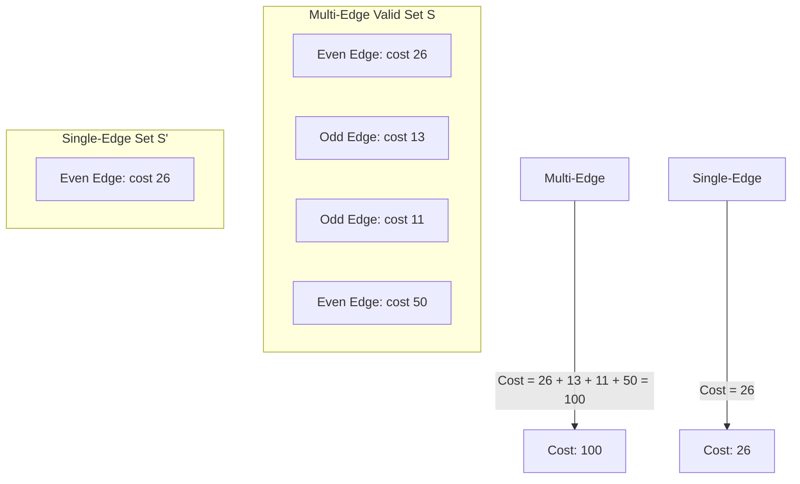

# Lock & Parity Explainer

## Problem Description & Example Test Case
You are given $N$ locks in a row (1-indexed). Each lock $i$ has a value $L[i]$. There is also one key under each lock, and key $j$ has value $L[j]$.
You may assign some keys to some locks under the following rules:
1. You may assign key $j$ to lock $i$ only if: $j < i$.
2. Assignments where the key and lock have the same value are forbidden: $L[j] \neq L[i]$.
3. Assigning key $j$ to lock $i$ gives an effective value: $E = |L[j] - L[i]|$.
4. Each lock can be assigned at most once, and each key can be used at most once.
5. Let `even` be the number of assignments with even effective value, and `odd` be the number of assignments with odd effective value. A set of assignments is valid only if: `even >= odd`.
6. You must perform at least one assignment.

Find the minimum possible sum of effective values over all valid assignment sets. If no valid set exists, output -1.

### Example Test Case
**Input:**
```text
6
41
54
15
4
54
4
```
**Output:**
```text
26
```
**Explanation:**
- Allowed even-cost assignments are:
  - $(1 \to 3)$ with cost $|41 - 15| = 26$ (even)
  - $(2 \to 4)$ with cost $|54 - 4| = 50$ (even)
  - $(2 \to 6)$ with cost $|54 - 4| = 50$ (even)
  - $(4 \to 5)$ with cost $|4 - 54| = 50$ (even)
  - $(5 \to 6)$ with cost $|54 - 4| = 50$ (even)
- The minimum cost is obtained by selecting just a single assignment $(1 \to 3)$ which has cost 26. This selection is valid because it has `even = 1` and `odd = 0` ($1 \ge 0$).

---

## Prerequisite Concepts
- **Bipartite Matching:** Matching elements from one set (keys) to another (locks).
- **Parity Properties:** The absolute difference $|a - b|$ is even if and only if $a$ and $b$ have the same parity (both even or both odd).

---

## The Naive Approach
A brute force approach would search all possible valid matching sets of keys and locks, checking the parity condition for each, and choosing the one with the minimum sum. Since we can choose any subset of keys and locks and match them, this is equivalent to searching over all matchings in a bipartite graph. The number of such matchings is extremely large ($O(2^{N^2})$), which is too slow.
- **Time Complexity:** $O(2^{N^2})$
- **Space Complexity:** $O(N^2)$

---

## Guided Discovery (The Optimal Approach)
Let's think about the structure of any valid assignment set.
What makes a set of assignments $S$ valid?
1. It must contain at least one assignment: $|S| \ge 1$.
2. The number of even-cost assignments in $S$ must be greater than or equal to the number of odd-cost assignments in $S$: $even(S) \ge odd(S)$.

If $even(S) \ge odd(S)$ and $|S| \ge 1$, what can we say about the number of even assignments in $S$?
Since the total number of assignments is $|S| = even(S) + odd(S) \ge 1$, and $even(S) \ge odd(S)$, the number of even assignments must be at least 1 ($even(S) \ge 1$).

This means **any valid assignment set $S$ must contain at least one even-cost assignment**. Let's select one such even-cost assignment $e^* \in S$.

What is the cost of our assignment set $S$?
Since the cost of each assignment is an absolute difference between two distinct values ($L[j] \neq L[i]$), the cost of every assignment is strictly positive: $w(e) > 0$ for all $e \in S$.
Therefore:
$$\text{Cost}(S) = \sum_{e \in S} w(e) \ge w(e^*)$$

Now, consider the singleton set $S' = \{e^*\}$.
Is $S'$ a valid assignment set?
- It contains exactly one assignment ($|S'| = 1 \ge 1$).
- Since $e^*$ is an even-cost assignment, $even(S') = 1$ and $odd(S') = 0$, which satisfies $even(S') \ge odd(S')$.
Thus, $S'$ is a valid assignment set!

And what is the cost of $S'$?
$$\text{Cost}(S') = w(e^*) \le \text{Cost}(S)$$

This yields a powerful insight: **For any valid assignment set $S$, there exists a single-edge valid assignment set $S' = \{e^*\}$ whose cost is less than or equal to the cost of $S$.**

Therefore, to minimize the sum of effective values, we only need to look at single-edge assignment sets containing a single even-cost edge!
Thus, the problem reduces to:
**Find the minimum weight of a single even-cost edge in the graph.**

An edge $(j, i)$ is valid if:
- $j < i$
- $L[j] \neq L[i]$
- $|L[j] - L[i]|$ is even.

If no such edge exists, then no valid assignment set can be formed, so we output -1. Otherwise, we output the minimum cost among all such edges.

---

## Visualizations
We can visualize the matching decision. Suppose we have a valid set $S$ containing multiple edges:



---

## Optimal Complexity Breakdown
- **Time Complexity:** $O(N^2)$ to check all pairs $(j, i)$ with $j < i$.
- **Space Complexity:** $O(1)$ auxiliary space.

---

## Pseudocode
```text
min_cost = infinity
for i from 0 to n-1:
    for j from 0 to i-1:
        if L[j] != L[i] and (L[j] - L[i]) is even:
            min_cost = min(min_cost, abs(L[j] - L[i]))

if min_cost == infinity:
    return -1
else:
    return min_cost
```
