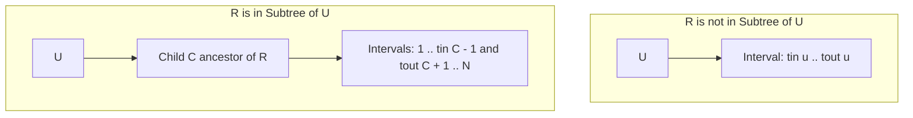

# Tree Rooted Subtree Intersection Explainer

## Problem Description & Example Test Case
You are given a tree consisting of $N$ nodes. You are also given two distinct nodes $A$ and $B$.
You are given an array $P$ where the parent of node $u$ is $P[u]$.
We define the beauty of a node pair $(U, V)$ as the number of nodes that belong to both:
- The subtree of $U$ when the tree is rooted at $A$.
- The subtree of $V$ when the tree is rooted at $B$.

You are given $Q$ queries. For each query, you are given two nodes $U$ and $V$.
Let $K$ be the answer to the last query (initially 0). The query values $U$ and $V$ are updated online:
- $U' = (U + K) \pmod N + 1$
- $V' = (V + K) \pmod N + 1$

Find the sum of answers to all queries. Since the answer can be large, return it modulo $10^9+7$.

### Example Test Case
**Input:**
```text
2
1
2
0
1
1
2
1 2
```
**Output:**
```text
0
```
**Explanation:**
- $N = 2, A = 1, B = 2, P = [0, 1], Q = 1, Col = 2$, queries = `[[1, 2]]`.
- Query 1: $U = 1, V = 2$.
  - $U' = (1 + 0) \pmod 2 + 1 = 2$
  - $V' = (2 + 0) \pmod 2 + 1 = 1$
  - Transformed query is $(2, 1)$, which is node 2 and node 1.
  - Subtree of node 2 when rooted at $A=1$ is $\{2\}$.
  - Subtree of node 1 when rooted at $B=2$ is $\{1\}$.
  - Intersection is $\emptyset$, size is 0.
- Hence, the sum of answers is 0.

---

## Prerequisite Concepts
- **DFS Order (tin/tout):** Mapping tree nodes to a 1D range where subtrees correspond to contiguous intervals.
- **Binary Lifting:** A technique to find ancestors in $O(\log N)$ time.
- **Rerooting Subtree Properties:** Expressing subtrees under an arbitrary root $R$ in terms of the default tree's subtrees.

---

## The Naive Approach
A naive approach would perform a DFS for each query to find the subtrees of $U$ and $V$ when rooted at $A$ and $B$, compute their intersection by set lookup, and sum the sizes. This takes $O(N)$ time per query, leading to $O(Q \cdot N)$ total time, which will TLE for $Q, N \le 10^5$.
- **Time Complexity:** $O(Q \cdot N)$
- **Space Complexity:** $O(N)$

---

## Guided Discovery (The Optimal Approach)
Let's see if we can represent the subtrees as intervals.
In the default tree rooted at some arbitrary node (e.g. 1):
Each node $u$ has a subtree range $[tin[u], tout[u]]$ in the DFS entry order.
A node $w$ is in the subtree of $u$ if and only if $tin[w] \in [tin[u], tout[u]]$.

When we reroot the tree at node $R$:
What is the subtree of $u$, denoted $Subtree_R(u)$?
- **Case 1:** $u = R$. The subtree is the entire tree, represented by interval $[1, N]$.
- **Case 2:** $R$ is not in the default subtree of $u$. The subtree is unchanged: $[tin[u], tout[u]]$.
- **Case 3:** $R$ is in the default subtree of $u$ ($R \neq u$). The parent of $u$ is now its child $C$ which is an ancestor of $R$. The subtree of $u$ becomes the entire tree minus the default subtree of $C$: $[1, tin[C]-1] \cup [tout[C]+1, N]$.

Thus, for any root and node, the subtree is a union of at most 2 disjoint intervals!
We can find the ancestor child $C$ in $O(\log N)$ time using **binary lifting**.

For each query $(U, V)$:
1. Find $S_A = Subtree_A(U)$ as a set of intervals (at most 2).
2. Find $S_B = Subtree_B(V)$ as a set of intervals (at most 2).
3. Intersect the two sets of intervals.
4. Sum the lengths of the resulting intervals.

Since we do at most $2 \times 2 = 4$ interval intersections per query, this step takes $O(1)$ time. The overall query time is dominated by finding $C$ using binary lifting, which takes $O(\log N)$ time!

---

## Visualizations
Subtree representation when root changes:



---

## Optimal Complexity Breakdown
- **Time Complexity:**
  - Preprocessing: $O(N \log N)$ to compute DFS order and binary lifting table.
  - Queries: $O(Q \log N)$ total.
- **Space Complexity:** $O(N \log N)$ for the binary lifting table.

---

## Pseudocode
```text
function get_intervals(U, root):
    if U == root:
        return [[1, N]]
    if not (tin[U] <= tin[root] <= tout[U]):
        return [[tin[U], tout[U]]]
    # root is in subtree of U, find child C of U that is ancestor of root
    C = get_child_ancestor(U, root)
    intervals = []
    if tin[C] > 1:
        intervals.append([1, tin[C] - 1])
    if tout[C] < N:
        intervals.append([tout[C] + 1, N])
    return intervals

function solve_query(U, V):
    int_A = get_intervals(U, A)
    int_B = get_intervals(V, B)
    ans = 0
    for [l1, r1] in int_A:
        for [l2, r2] in int_B:
            ans += max(0, min(r1, r2) - max(l1, l2) + 1)
    return ans
```
