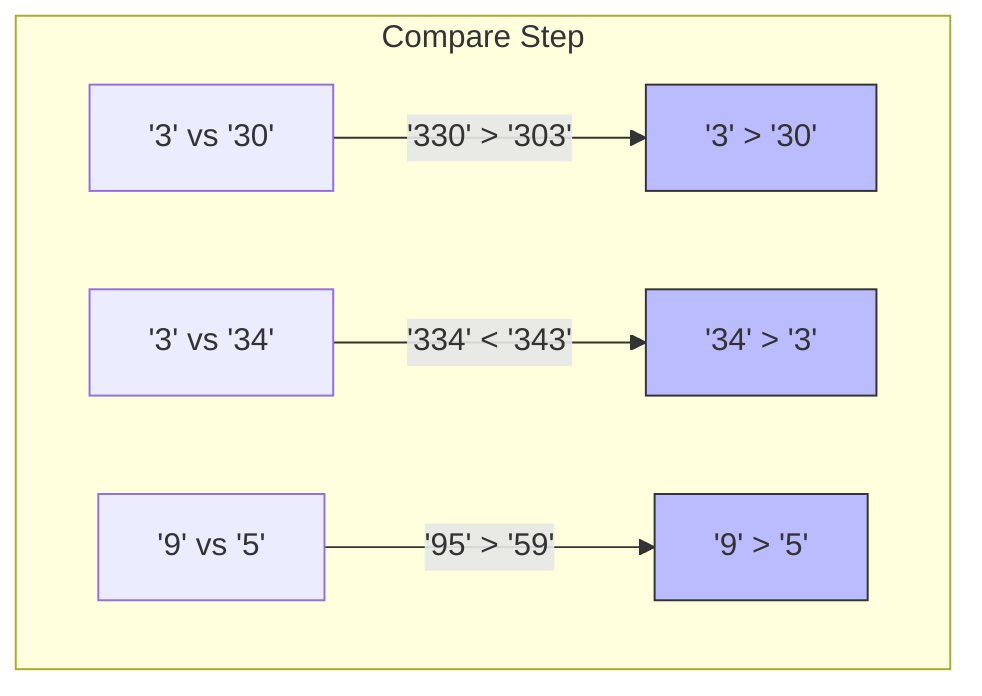

# Largest Number

## Prerequisite Concepts
Before diving into the solution, it is helpful to understand:
- **Custom Sorting:** Sorting elements based on a user-defined comparison rule rather than default numerical or alphabetical ordering.
- **Greedy Algorithms:** Making locally optimal choices at each step with the hope of finding a global optimum.
- **Transitivity of Comparator:** For sorting to be valid, the comparison operator must be transitive (if $A \succeq B$ and $B \succeq C$, then $A \succeq C$).

---

## The Naive Approach
A naive brute-force method generates all possible permutations of the input strings, concatenates each permutation, converts the result to a large integer, and tracks the maximum value found.

- **Time Complexity:** $O(N! \cdot N \cdot K)$ where $N$ is the number of elements and $K$ is the average length of the strings. There are $N!$ permutations, and concatenating $N$ strings of length $K$ takes $O(N \cdot K)$ time.
- **Space Complexity:** $O(N \cdot K)$ to store the permutations and concatenated results.

---

## Guided Discovery (The Optimal Approach)

Let's think about how we can optimize this.

Suppose we have two strings, $x = \text{"3"}$ and $y = \text{"30"}$. Which one should come first in the final number?
Let's try both configurations:
1. $x$ before $y$: $\text{"3" + "30" = "330"}$
2. $y$ before $x$: $\text{"30" + "3" = "303"}$

Comparing the results, $\text{"330"} > \text{"303"}$. Therefore, $x$ should precede $y$ in the arrangement.

What if we have two other strings, $x = \text{"34"}$ and $y = \text{"5"}$?
1. $x$ before $y$: $\text{"345"}$
2. $y$ before $x$: $\text{"534"}$

Since $\text{"534"} > \text{"345"}$, $y$ should precede $x$.

Does this comparison rule generalize to a consistent sorting criterion?
Yes! For any two strings $A$ and $B$, we define our custom comparison rule:
- If $A + B > B + A$, then $A$ should come before $B$ (we say $A \succ B$).
- If $A + B < B + A$, then $B$ should come before $A$ (we say $B \succ A$).

If we sort the entire array of strings in descending order using this custom comparator, will the concatenated result be the largest possible number?
Yes. It can be mathematically proven that this relation is transitive, meaning it forms a valid total order. A sorted sequence according to this order guarantees the globally maximum concatenated string.

### Edge Case
What if the input contains only zeros, e.g., `["0", "0"]`?
Sorting them gives `["0", "0"]`.
Concatenating them gives `"00"`.
But the correct representation of zero is simply `"0"`.
To handle this, if the leading element in our sorted array is `"0"`, the entire number must be `0`. We can simply return `"0"`.

---

## Visualizations

Let's visualize the sorting comparison process for `arr = ["3", "30", "34", "5", "9"]`.



Let's track the final sorted state:

| Element | 9 | 5 | 34 | 3 | 30 |
| --- | - | - | -- | - | -- |
| **Rank** | 1st | 2nd | 3rd | 4th | 5th |

*Concatenated Result:* `"9534330"`

---

## Optimal Complexity Breakdown

- **Time Complexity:** $O(N \log N \cdot K)$, where $N$ is the number of elements and $K$ is the average string length. Sorting the array takes $O(N \log N)$ comparisons. Each comparison concatenates two strings of length $K$ and compares them, which takes $O(K)$ time.
- **Space Complexity:** $O(N \cdot K)$ to store the copy of strings for sorting and concatenation.

---

## Pseudocode
```text
import functools

function largestNumber(arr):
    # Convert all integers to strings
    str_arr = map string over arr
    
    # Custom comparator
    function compare(x, y):
        if x + y > y + x:
            return -1 # x comes first
        else if x + y < y + x:
            return 1  # y comes first
        else:
            return 0
            
    sort str_arr using compare
    
    # Handle leading zero edge case
    if str_arr[0] == "0":
        return "0"
        
    return concatenate str_arr
```
