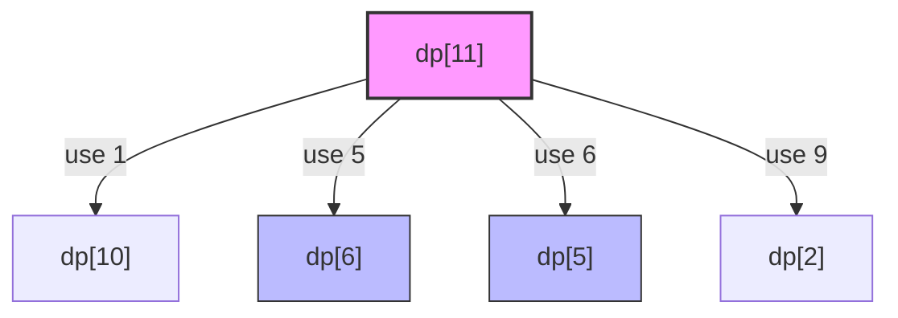

# Minimum Coins Required

## Prerequisite Concepts
Before diving into the solution, it is helpful to understand:
- **Dynamic Programming (DP):** A method for solving complex problems by breaking them down into simpler subproblems and storing the results of these subproblems to avoid redundant computations.
- **State Transition Relation:** The mathematical formula that links the solution of a larger problem to the solutions of its smaller subproblems.

---

## The Naive Approach
A naive brute-force method uses simple recursion. To find the minimum coins to make a value $V$, we try every coin $c$ in our denominations array. For each coin, we recursively solve for the remaining amount $V - c$, and add $1$ to the result. We then take the minimum of all these recursive results.

- **Time Complexity:** $O(N^V)$ where $N$ is the number of coin denominations and $V$ is the target value. The recursion tree can grow exponentially as we branch $N$ times at each level of depth up to $V$.
- **Space Complexity:** $O(V)$ due to the maximum depth of the recursion stack.

---

## Guided Discovery (The Optimal Approach)

Let's think about how we can optimize this. 

Suppose we want to make change for $V = 11$ using coins $\{1, 5, 6, 9\}$. 

If we knew the minimum coins needed for all values less than $11$, how would that help us?
If we decide to use a coin of denomination $6$ as the final coin, the remaining amount to make is $11 - 6 = 5$.
What is the minimum number of coins to make $5$? If we already computed that, let's call it $dp[5]$. Then, the candidate solution using $6$ as the last coin would be $dp[5] + 1$.

But wait, why limit ourselves to the coin $6$? We have other options:
- If we use coin $1$, the remaining amount is $10$. The cost would be $dp[10] + 1$.
- If we use coin $5$, the remaining amount is $6$. The cost would be $dp[6] + 1$.
- If we use coin $9$, the remaining amount is $2$. The cost would be $dp[2] + 1$.

How do we choose which option to take? 
Naturally, we want the minimum of all these candidate costs! This leads us to a simple mathematical observation:
$$dp[i] = \min_{c \in coins} (dp[i - c] + 1)$$
where $dp[i]$ represents the minimum coins required to make change for value $i$.

Wait, what is our base case? How many coins does it take to make $0$?
Clearly, $0$ coins are needed to make a value of $0$. Thus, $dp[0] = 0$.

If we build this DP table from $1$ up to $V$ iteratively, we can solve each subproblem exactly once using previously calculated values!

Let's define the algorithm concretely:
1. Initialize a $dp$ array of size $V + 1$ with a sentinel value representing infinity (or a large number like $V + 1$, since we can never need more than $V$ coins of value 1).
2. Set $dp[0] = 0$.
3. For each value $i$ from $1$ to $V$:
   - For each coin $c$ in our coin denominations:
     - If $i - c \ge 0$, update $dp[i] = \min(dp[i], dp[i - c] + 1)$.
4. If $dp[V]$ is still infinity, it's impossible to make that change, so we return $-1$. Otherwise, we return $dp[V]$.

---

## Visualizations

Let's visualize the transition logic for $V = 11$ using coin denominations $\{1, 5, 6, 9\}$.



Below is the DP array state representation as we fill it from left to right:

| $i$ | 0 | 1 | 2 | 3 | 4 | 5 | 6 | 7 | 8 | 9 | 10 | 11 |
| --- | - | - | - | - | - | - | - | - | - | - | -- | -- |
| **$dp[i]$** | 0 | 1 | 2 | 3 | 4 | 1 | 1 | 2 | 3 | 1 | 2 | 2 |

*Note on $dp[11]$:*
- $dp[11] = \min(dp[10]+1, dp[6]+1, dp[5]+1, dp[2]+1) = \min(2+1, 1+1, 1+1, 2+1) = 2$ (which corresponds to using coin 6 and coin 5).

---

## Optimal Complexity Breakdown

- **Time Complexity:** $O(N \cdot V)$, where $N$ is the number of coins and $V$ is the target value. We have a nested loop: the outer loop runs $V$ times, and the inner loop runs $N$ times.
- **Space Complexity:** $O(V)$ to store the DP array of size $V + 1$.

---

## Pseudocode
```text
function minCoins(coins, V):
    dp = array of size V + 1 initialized to infinity
    dp[0] = 0
    
    for i from 1 to V:
        for each coin in coins:
            if i - coin >= 0:
                dp[i] = min(dp[i], dp[i - coin] + 1)
                
    return dp[V] if dp[V] != infinity else -1
```
