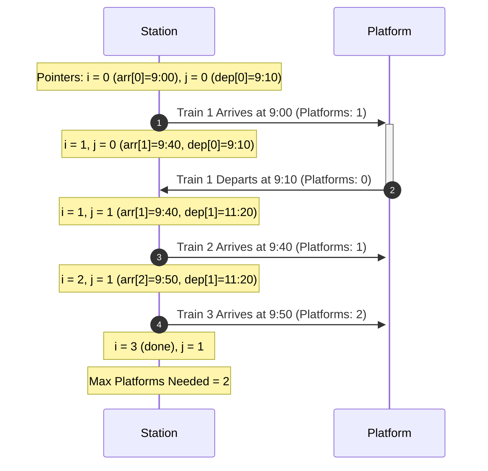

# Minimum Platforms Required

## Problem Description & Example Test Case
Given the arrival and departure times of all trains that reach a railway station, the task is to find the minimum number of platforms required for the railway station so that no train waits. We are given two arrays that represent the arrival and departure times of trains that stop.

### Example:
- **Input:** `arr[] = {9:00, 9:40, 9:50, 11:00, 15:00, 18:00}`, `dep[] = {9:10, 12:00, 11:20, 11:30, 19:00, 20:00}`
- **Output:** `3` (There are at-most three trains at a time (time between 9:40 to 12:00))
- **Input:** `arr[] = {9:00, 9:40}`, `dep[] = {9:10, 12:00}`
- **Output:** `1` (Only one platform is needed)

---

## Prerequisite Concepts
Before diving into the solution, it is helpful to understand:
- **Sorting:** Arranging elements in ascending order.
- **Two Pointers Technique:** Using two indices to scan through two lists simultaneously.
- **Greedy Approach (Interval Overlap):** Solving scheduling and overlapping intervals by observing events chronologically.

---

## The Naive Approach
A naive brute force approach checks every train interval and counts how many other train intervals overlap with it. The maximum overlap count found across all intervals gives the minimum number of platforms.

- **Time Complexity:** $O(N^2)$ where $N$ is the number of trains.
- **Space Complexity:** $O(1)$.

---

## Guided Discovery (The Optimal Approach)

Let's think about how we can optimize this.

Imagine we are standing at the railway station platform with a notebook. Every time a train arrives, we increment a counter by $1$. Every time a train departs, we decrement the counter by $1$. The maximum value of this counter at any point in time will be the minimum number of platforms needed.

Does it matter *which* specific train arrives or departs?
No! We only care about the *events* of arrivals and departures.

If we sort all arrival times and departure times, we can simulate the passage of time chronologically. 

Wait, can we sort the arrival times and departure times independently?
Yes! Let's say:
- `arr` = arrival times (sorted)
- `dep` = departure times (sorted)

Let's use two pointers:
- `i` pointing to the current arrival in `arr`.
- `j` pointing to the current departure in `dep`.

At each step, we compare the next arrival time `arr[i]` with the next departure time `dep[j]`:
- **If `arr[i] <= dep[j]`:** A train is arriving before (or exactly when) another train departs. We need a platform for this new train, so we increment our current platform count and advance `i`.
- **If `arr[i] > dep[j]`:** A train departs before the next train arrives. One platform becomes free, so we decrement our current platform count and advance `j`.

Throughout this traversal, we record the maximum platform count reached.

### Why does independent sorting work?
Even though independent sorting breaks the association between a specific train's arrival and its departure, the *chronological sequence* of events remains valid. Any arrival event at index `i` is guaranteed to be paired with a corresponding departure event. The algorithm matches the earliest available departures with arrivals, which is a greedy strategy that correctly minimizes active platform usage.

---

## Visualizations

Let's visualize the timeline comparison for:
- `arr = [9:00, 9:40, 9:50]`
- `dep = [9:10, 11:20, 12:00]` (sorted)



---

## Optimal Complexity Breakdown

- **Time Complexity:** $O(N \log N)$ where $N$ is the number of trains. Sorting the arrival and departure times takes $O(N \log N)$ time. The two-pointer traversal takes $O(N)$ time.
- **Space Complexity:** $O(N)$ (or $O(1)$) depending on whether we sort in-place or make copies of the arrays.

---

## Pseudocode
```text
function findPlatform(arr, dep):
    sort(arr)
    sort(dep)
    
    i = 0, j = 0
    current_platforms = 0
    max_platforms = 0
    
    while i < length(arr) and j < length(dep):
        if arr[i] <= dep[j]:
            current_platforms += 1
            max_platforms = max(max_platforms, current_platforms)
            i += 1
        else:
            current_platforms -= 1
            j += 1
            
    return max_platforms
```
