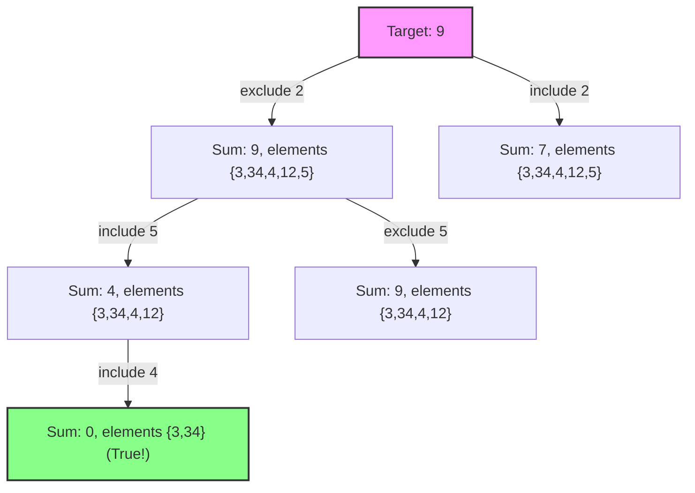

# Subset Sum

## Problem Description & Example Test Case
Given a set of non-negative integers and a value `sum`, the task is to check if there is a subset of the given set whose sum is equal to the given `sum`.

### Example:
- **Input:** `set[] = {3, 34, 4, 12, 5, 2}`, `sum = 9`
- **Output:** `True` (There is a subset (4, 5) with sum 9)
- **Input:** `set[] = {3, 34, 4, 12, 5, 2}`, `sum = 30`
- **Output:** `False` (There is no subset that adds up to 30)

---

## Prerequisite Concepts
Before diving into the solution, it is helpful to understand:
- **Subsets:** A subset is a portion of a set, containing any combination of its elements (including the empty set and the set itself).
- **Dynamic Programming (DP):** Storing solutions to smaller subproblems to build the solution for the target problem.
- **Space Optimization in DP:** Reducing memory usage from a 2D grid to a 1D array by observing row-to-row dependencies.

---

## The Naive Approach
The naive approach uses simple recursion (backtracking). For each element in the set, we make a binary choice: either include it in the subset or exclude it. We recursively check both choices.

- **Time Complexity:** $O(2^N)$ where $N$ is the number of elements in the set. At each step, we have two branching choices, leading to a binary tree of depth $N$.
- **Space Complexity:** $O(N)$ due to the maximum depth of the recursion stack.

---

## Guided Discovery (The Optimal Approach)

Let's think about how we can optimize this.

Suppose we want to find if a subset sums to `9` using the set $\{3, 34, 4, 12, 5, 2\}$.

Consider the last element, `2`. If we check if a subset sums to `9`:
1. **Exclude `2`:** If we don't use `2`, we must be able to form the sum `9` using only the remaining elements $\{3, 34, 4, 12, 5\}$.
2. **Include `2`:** If we do use `2`, then the rest of the subset must sum to `9 - 2 = 7` using only the remaining elements $\{3, 34, 4, 12, 5\}$.

If either of these choices is possible, then the sum `9` is possible!

Let's generalize this. Let $dp[i][j]$ be a boolean indicating if a sum of $j$ is possible using the first $i$ elements.
$$dp[i][j] = dp[i - 1][j] \lor dp[i - 1][j - \text{num}]$$
where $\text{num}$ is the value of the $i$-th element, and $j \ge \text{num}$.

### Space Optimization
Do we really need a 2D table of size $N \times (\text{sum} + 1)$?
Look closely at the relation: $dp[i][j]$ only depends on values from the previous row $i - 1$.
Could we just use a 1D array of size `sum + 1`?

Yes, but we must be careful. If we update the array from left to right (from $0$ to $\text{sum}$), then when we calculate the new value for index $j$, the value at index $j - \text{num}$ has already been updated for the current element! That would mean we might reuse the same element multiple times (like in the Unbounded Knapsack/Coin Change problem).

How do we solve this?
What if we iterate from right to left (from $\text{sum}$ down to $\text{num}$)?
When we update $dp[j]$ using $dp[j - \text{num}]$, the value at $dp[j - \text{num}]$ is still from the *previous* element's iteration! This perfectly simulates the 2D DP transition using only a 1D array.

Let's write down the base case:
- A sum of $0$ is always possible (by choosing the empty subset). So $dp[0] = \text{True}$.
- All other sums are initially $\text{False}$.

---

## Visualizations

Let's visualize the dependency tree for deciding if target sum `9` is possible.



Below is the state transitions of the 1D DP array for set $\{3, 4, 5, 2\}$ and target $9$:

- **Start:** `dp = [True, False, False, False, False, False, False, False, False, False]` (size 10)
- **After 3:** `dp[3] = dp[3] | dp[0] -> True`
- **After 4:** `dp[7] = dp[7] | dp[3] -> True`, `dp[4] = dp[4] | dp[0] -> True`
- **After 5:** `dp[9] = dp[9] | dp[4] -> True`, `dp[8] = dp[8] | dp[3] -> True`, `dp[5] = dp[5] | dp[0] -> True`
- **End:** `dp[9]` is `True` (formed by subset `{4, 5}`).

---

## Optimal Complexity Breakdown

- **Time Complexity:** $O(N \cdot \text{sum})$, where $N$ is the number of elements in the set, and $\text{sum}$ is the target sum. We iterate through each element and update the DP table from $\text{sum}$ down to $\text{num}$.
- **Space Complexity:** $O(\text{sum})$ since we only store a 1D array of size $\text{sum} + 1$.

---

## Pseudocode
```text
function isSubsetSum(arr, targetSum):
    dp = array of size targetSum + 1 initialized to False
    dp[0] = True
    
    for num in arr:
        for j from targetSum down to num:
            dp[j] = dp[j] or dp[j - num]
            
    return dp[targetSum]
```
