# Wine Bottle Transport

## Problem Description & Example Test Case
Given an array `Arr[]` of size `N` representing `N` houses built along a straight line with equal distance between adjacent houses. Each house has a certain number of wine and they want to buy/sell those wines to other houses. Transporting one bottle of wine from one house to an adjacent house results in one unit of work. The task is to find the minimum number of work is required to fulfill all the demands of those `N` houses.

### Example:
- **Input:** `N = 5`, `Arr[] = {5, -4, 1, -3, 1}`
- **Output:** `9`
- **Explanation:** 
  1. The 1st house can sell 4 wine bottles to the 0th house. Total work needed = $4 \times (1-0) = 4$. The new state is `Arr[] = {1, 0, 1, -3, 1}`.
  2. The 3rd house can sell wine to the 0th, 2nd, and 4th houses. Total work needed = $1 \times (3-0) + 1 \times (3-2) + 1 \times (4-3) = 5$.
  3. Total work is $4 + 5 = 9$.

---

## Prerequisite Concepts

Before diving into the solution, it is helpful to understand:
1. **Array Representation & Prefix Sums:** Fulfilling demands sequentially from one end requires tracking cumulative imbalances.
2. **Greedy Algorithms:** Making the locally optimal choice (balancing the leftmost house first) leads to a globally optimal solution.
3. **Absolute Differences & Distance:** The work required to move $k$ bottles of wine across a distance $d$ is $k \times d$. Since the houses are adjacent (distance = 1), moving $k$ bottles from house $i$ to house $i+1$ costs exactly $k$ units of work.

---

## The Naive Approach

A brute-force simulation would pair up each supplying house (seller) with demanding houses (buyers) and calculate the transport cost. 
* We would find a house $i$ with a surplus ($Arr[i] > 0$) and a house $j$ with a deficit ($Arr[j] < 0$).
* We would satisfy the demand by shifting wine from $i$ to $j$, adding $|i - j| \times \text{transferred\_bottles}$ to the total work.
* We would repeat this until all supplies and demands are resolved.

### Complexity
- **Time Complexity:** $O(N^2)$ because we may have to scan the array repeatedly to match buyers and sellers.
- **Space Complexity:** $O(1)$ if done in place or $O(N)$ to keep track of matched states.

---

## Guided Discovery (The Optimal Approach)

Let's break down the problem together to find a more efficient solution.

### Note Observation
Consider the leftmost house, House $0$. It has some quantity of wine $Arr[0]$. 
* If $Arr[0] > 0$, it has a surplus of bottles that **must** be sent to other houses. Since the houses are in a straight line, these bottles have only one direction to go: to the right (towards House $1$).
* If $Arr[0] < 0$, it has a deficit that **must** be filled by bottles coming from the right.

In either case, the quantity of wine crossing the boundary between House $0$ and House $1$ is exactly $|Arr[0]|$. 

### Invoke Curiosity
*What happens after we cross this boundary?*
Once we move $|Arr[0]|$ bottles across the boundary, the balance at House $0$ is perfectly resolved. However, House $1$ now has its own initial supply/demand $Arr[1]$ plus or minus the bottles that crossed from House $0$. 
Thus, the net demand or supply at House $1$ becomes $Arr[1] + Arr[0]$.

*Can we generalize this logic?*
Let's define a boundary $i$ as the line separating House $i$ and House $i+1$. 
To completely satisfy all houses in the prefix $0, 1, \dots, i$, any net imbalance in this prefix **must** cross boundary $i$ to be resolved by the houses in the suffix $i+1, \dots, N-1$.

### Build Intuition
The net imbalance of the prefix $0, 1, \dots, i$ is simply the cumulative sum (prefix sum) of the elements up to index $i$:
$$\text{imbalance}_i = \sum_{j=0}^{i} Arr[j]$$

Since boundary $i$ connects adjacent houses (distance = 1), transporting this imbalance across the boundary costs exactly:
$$\text{work}_i = |\text{imbalance}_i|$$

Therefore, the total work required is the sum of the work done at each boundary:
$$\text{Total Work} = \sum_{i=0}^{N-2} |\text{imbalance}_i|$$

### Concrete Definition
1. We iterate through the houses from left to right.
2. We maintain a running sum (`imbalance`) of the supplies and demands.
3. At each step, we add the absolute value of the running sum (`abs(imbalance)`) to our total work.
4. Because the total supply matches the total demand, the final running sum after the last house will be $0$.

---

## Visualizations

Let's trace Example 1: `Arr = [5, -4, 1, -3, 1]`

### Flow of Wine Across Boundaries

```mermaid
flowchart LR
    H0["House 0\nSupply: +5"] === B0["Boundary 0\nFlow: +5\nWork: 5"] === H1["House 1\nDemand: -4"]
    H1 === B1["Boundary 1\nFlow: +1\nWork: 1"] === H2["House 2\nSupply: +1"]
    H2 === B2["Boundary 2\nFlow: +2\nWork: 2"] === H3["House 3\nDemand: -3"]
    H3 === B3["Boundary 3\nFlow: -1\nWork: 1"] === H4["House 4\nSupply: +1"]

    style H0 fill:#d4edda,stroke:#28a745,stroke-width:2px,color:#000
    style H1 fill:#f8d7da,stroke:#dc3545,stroke-width:2px,color:#000
    style H2 fill:#d4edda,stroke:#28a745,stroke-width:2px,color:#000
    style H3 fill:#f8d7da,stroke:#dc3545,stroke-width:2px,color:#000
    style H4 fill:#d4edda,stroke:#28a745,stroke-width:2px,color:#000
    style B0 fill:#fff3cd,stroke:#ffc107,stroke-width:1px,color:#000
    style B1 fill:#fff3cd,stroke:#ffc107,stroke-width:1px,color:#000
    style B2 fill:#fff3cd,stroke:#ffc107,stroke-width:1px,color:#000
    style B3 fill:#fff3cd,stroke:#ffc107,stroke-width:1px,color:#000
```



### Cumulative Work Accumulation Table

| House Index $i$ | Wine $Arr[i]$ | Cumulative Imbalance | Work Contribution $|\text{Imbalance}|$ | Total Work |
| :---: | :---: | :---: | :---: | :---: |
| 0 | 5 | 5 | 5 | 5 |
| 1 | -4 | 1 | 1 | 6 |
| 2 | 1 | 2 | 2 | 8 |
| 3 | -3 | -1 | 1 | 9 |
| 4 | 1 | 0 | 0 | 9 |

---

## Optimal Complexity Breakdown

- **Time Complexity:** $\mathcal{O}(N)$
  We perform a single pass over the array of size $N$, doing constant time $\mathcal{O}(1)$ operations at each step.
- **Space Complexity:** $\mathcal{O}(1)$
  We only need two scalar variables to keep track of the cumulative work and the running imbalance.

---

## Pseudocode

```text
function minWorkToTransportWine(Arr, N):
    work = 0
    imbalance = 0
    
    for i from 0 to N - 1:
        imbalance = imbalance + Arr[i]
        work = work + abs(imbalance)
        
    return work
```
